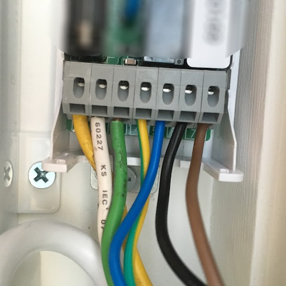
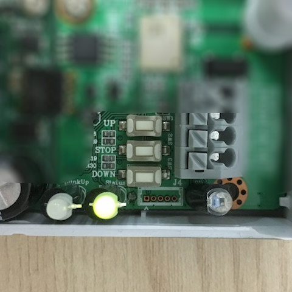
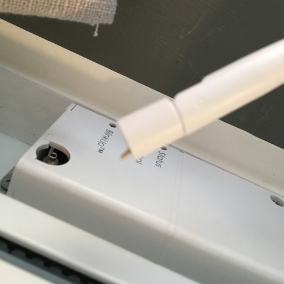
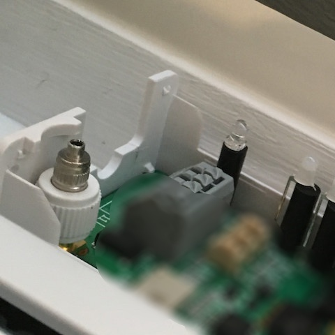
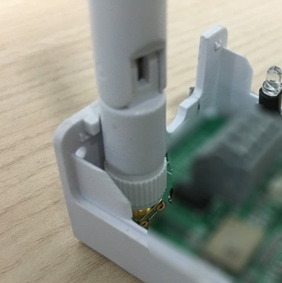
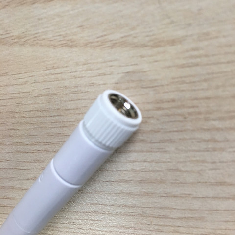

## 목적

이 문서는 솔라존을 설치 또는 사용하면서 발생했던 문제 증상에 대한 조치 방법을 정리하여, 보다 원할한 문제 해결을 위해 작성되었습니다.
문서에 대한 의견이나 건의 내용은 as@inthecore.co.kr로 보내주세요.

### 앱에서 커튼이 반대로 동작해요 (열기를 누르면 닫혀요)

솔라존 제품을 모터 결선할 때 UP과 DOWN을 반대로 연결할 경우 발생합니다.
커튼일 경우, 솔라존 제품의 UP 스위치를 눌렀을 때 커튼이 열리도록, DOWN 스위치를 눌렀을 때 커튼이 닫히도록 결선하세요.

결선 예 입니다

커튼일 경우 UP 스위치를 누를 때 커튼이 열리도록 결선하세요

### 앱에서 블링크업이 계속 실패해요

먼저, 다음을 체크해주세요.
- 솔라존이 연결할 Wi-Fi를 휴대폰에서 연결하고 네이버를 실행해서 인터넷 연결이 올바르게 되었는지 확인하세요.
- 연결할 Wi-Fi가 2GHz인지 확인하세요. 5Ghz는 연결할 수 없습니다.
- 블링크업은 휴대폰 화면의 깜빡임으로 Wi-Fi 정보를 전송하는 방식입니다. 블링크업할 때 휴대폰 화면을 솔라존 제품의 BlinkUp 센서에 가까이 접촉하세요.
- Wi-Fi 비밀번호가 올바른지 확인하세요.

그럼에도 불구하고 계속 실패한다면 솔라존 제품의 안테나가 올바르게 고정되어있는지 확인하세요.
돌출된 안테나에 강한 충격이 가해지면 접촉 불량이 발생할 수 있습니다. 흔들리는 안테나를 시계 방향으로 돌려서 고정하세요. 또는 새 안테나로 교체하세요.

접촉 불량 안테나

솔라존 본체와 분리된 안테나

올바르게 고정된 안테나

안테나는 시계 방향으로 돌리면 고정됩니다
